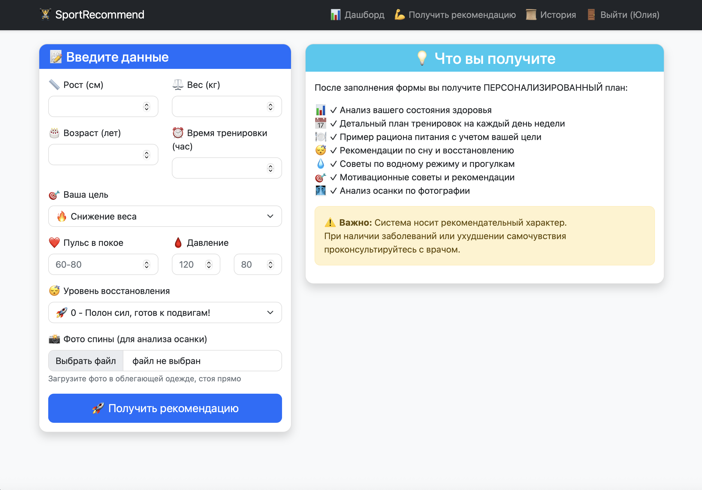
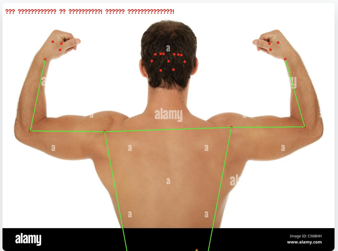
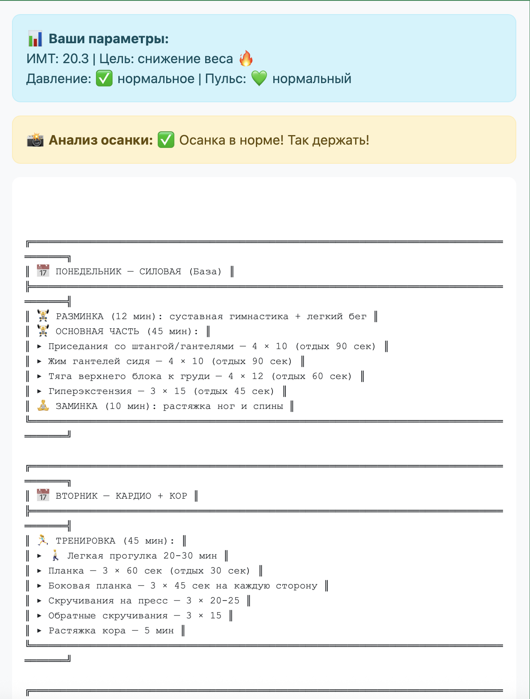
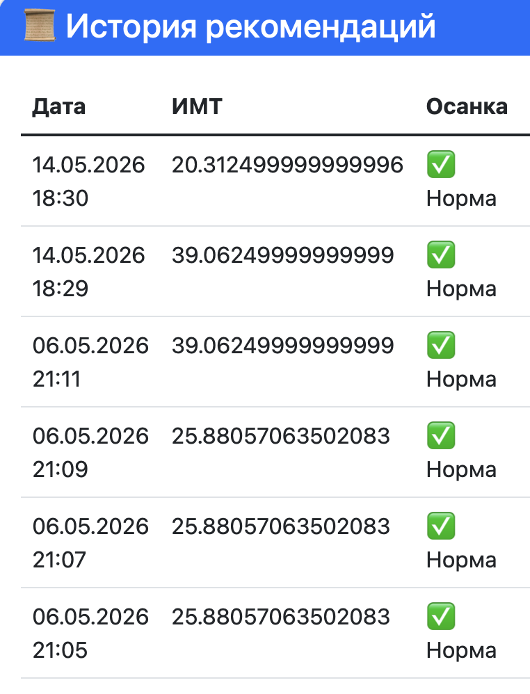

# Система рекомендаций тренировочных нагрузок

Веб-сервис для персонализации тренировок на основе машинного обучения и компьютерного зрения.

## О проекте

Система анализирует антропометрические данные, медицинские показатели и фотографию спины, чтобы персонализировать тренировочные нагрузки.

### Функциональные возможности

- Регистрация и авторизация пользователей
- Анализ медицинских показателей (пульс, давление, ИМТ)
- Компьютерное зрение для оценки осанки (MediaPipe Pose)
- Машинное обучение для классификации нагрузок (Gradient Boosting)
- Генерация недельного плана тренировок
- Рекомендации по питанию и восстановлению
- История рекомендаций в личном кабинете
## Скриншоты

### Форма ввода данных

### Анализ осанки

### Пример рекомендации

### История рекомендаций

## Технологии

| Компонент | Технология |
|-----------|------------|
| Backend | Python, Flask |
| Машинное обучение | scikit-learn (Gradient Boosting) |
| Компьютерное зрение | MediaPipe Pose, OpenCV |
| База данных | SQLite + SQLAlchemy |
| Frontend | Bootstrap 5, Jinja2 |

## Установка и запуск

### 1. Клонировать репозиторий

git clone https://github.com/julia26-joker/sport-recommendation-system.git
cd sport-recommendation-system

### 2. Создать виртуальное окружение

macOS / Linux:
python3 -m venv venv
source venv/bin/activate

Windows:
python -m venv venv
venv\Scripts\activate

### 3. Установить зависимости

pip install -r requirements.txt

### 4. Скачать ML-модель для MediaPipe

curl -L -o pose_landmarker.task https://storage.googleapis.com/mediapipe-models/pose_landmarker/pose_landmarker_lite/float16/1/pose_landmarker_lite.task

### 5. Запустить приложение

python app.py

### 6. Открыть в браузере

http://localhost:5000

## Результаты тестирования

| Метрика | Значение |
|---------|----------|
| Точность классификации | 92% |
| F1-мера (отдых/ЛФК) | 0,93 |
| F1-мера (интенсивная нагрузка) | 0,94 |
| Чувствительность CV-модуля | 0,90 |
| Время отклика системы | до 2,1 сек |

## Структура проекта

- `app.py` — главный файл приложения
- `models.py` — модели базы данных
- `recommender.py` — ML-модель Gradient Boosting
- `posture_analyzer.py` — модуль компьютерного зрения
- `requirements.txt` — зависимости
- `docs/images/` — скриншоты
- `templates/` — HTML-шаблоны
- `static/` — CSS и загрузки
- `instance/` — база данных (игнорируется git)
## Автор

Зубова Юлия Андреевна
НИУ ВШЭ, Нижний Новгород
Факультет информатики, математики и компьютерных наук
Направление: Компьютерные науки и технологии

Руководитель: Цыганков Вячеслав Вячеславович

## Дисклеймер

Система носит рекомендательный характер. При наличии заболеваний или ухудшении самочувствия необходима консультация врача.
